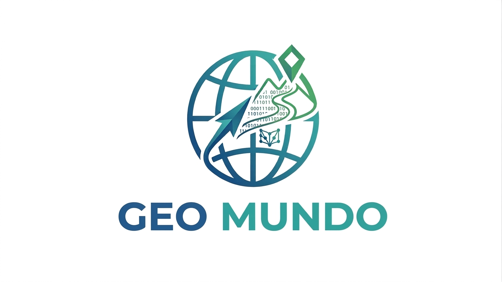

# 🌎 Geo Mundo

## Equipe

| Nome | Função |
|------|---------|
| Yasmin Francischelli |
| Laura Ubaldo |
| Sophia Peron |
| Fernanda Machado |

---

## Problema de Negócio

* Dificuldade no aprendizado de hidrografia
* Falta de recursos interativos no ensino tradicional
* Baixo engajamento dos alunos em conteúdos geográficos
* Dificuldade na compreensão de rios e bacias hidrográficas
* Pouco uso de tecnologia no ensino de geografia

---

## Escopo do Projeto

* Plataforma educacional interativa
* Ensino de hidrografia brasileira
* Sistema de quiz educativo
* Exibição de informações sobre rios
* Busca rápida de rios
* Exibição de imagens ilustrativas
* Sistema de progresso do usuário

---

## Objetivos

* Facilitar o aprendizado de hidrografia
* Tornar o ensino mais visual e dinâmico
* Melhorar o desempenho dos estudantes
* Incentivar o uso de tecnologia na educação
* Auxiliar professores em sala de aula
* Tornar o conteúdo mais acessível

---

## Público-Alvo

* Estudantes do Ensino Fundamental II
* Estudantes do Ensino Médio
* Professores de Geografia
* Interessados em geografia

---

## Stakeholders

### Principais

* Estudantes
* Professores
* Instituições de ensino

### Secundários

* Escolas
* Cursos preparatórios
* Desenvolvedores educacionais

---

## Identidade Visual

### Simbologia

* Globo representa geografia e conhecimento
* Elementos aquáticos representam rios e hidrografia
* Interface moderna representa tecnologia educacional

### Paleta de Cores

* Azul Oceano (#0077B6)
* Azul Claro (#48CAE4)
* Verde Natureza (#2D6A4F)
* Branco (#FFFFFF)

### Tipografia

* Poppins
* Arial
* Fonte moderna e legível

---

# 📱 Requisitos Funcionais

## RF01 – Página Inicial
O sistema deve apresentar:
- Nome do aplicativo
- Nome da disciplina
- Navegação entre telas

## RF02 – Navegação
Permitir navegação entre:
- Página inicial
- Conteúdos
- Quiz
- Resultado
- Sobre

## RF03 – Listagem de Conteúdos
Exibir lista dos principais rios do Brasil.

## RF04 – Seleção de Conteúdo
Permitir selecionar um rio para visualizar detalhes.

## RF05 – Detalhes do Rio
Exibir:
- Nome
- Extensão
- Região
- Importância
- Curiosidades

## RF06 – Imagens
Mostrar imagens ilustrativas relacionadas aos rios.

## RF07 – Quiz
Exibir:
- 5 perguntas
- 4 alternativas

## RF08 – Verificação de Respostas
Mostrar:
- Acerto ou erro
- Feedback visual
- Pontuação

## RF09 – Resultado
Exibir:
- Acertos
- Erros
- Pontuação total
- Feedback final

## RF10 – Reinício do Quiz
Permitir refazer o quiz.

## RF11 – Página Sobre
Exibir:
- Nome do projeto
- Tema
- Integrantes
- Professor
- Tecnologias

---

# ⚙️ Requisitos Não Funcionais

## RNF01 – Usabilidade
- Navegação simples
- Botões visíveis
- Interface intuitiva

## RNF02 – Desempenho
- Resposta em até 3 segundos

## RNF03 – Plataforma
- Flutter + Dart

## RNF04 – Interface
- Layout organizado
- Boa legibilidade
- Cores harmoniosas

## RNF05 – Acessibilidade
- Fontes legíveis
- Bom contraste

## RNF06 – Organização do Código
- Código modularizado
- Comentado
- Fácil manutenção

## RNF07 – Feedback Visual
- Cores de resposta
- Mensagens informativas

## RNF08 – Responsividade
- Compatível com diferentes tamanhos de tela

---

## Tecnologias

### Front-end

* Flutter
* Dart
* Material Design

---

## Funcionalidades da Plataforma

### Quiz Educativo

* Perguntas sobre hidrografia
* Sistema de pontuação
* Feedback visual
* Controle de acertos e erros

### Sistema de Progresso

* Exibição de desempenho
* Acompanhamento de evolução

### Busca Inteligente

* Pesquisa rápida de rios
* Navegação facilitada

### Conteúdo Visual

* Imagens ilustrativas
* Informações detalhadas
* Conteúdo educativo

---

## Conteúdos Disponíveis

* Rio Amazonas
* Rio Paraná
* Rio Madeira
* Rio Purus
* Rio São Francisco
* Rio Tocantins
* Rio Araguaia
* Rio Japurá
* Bacias Hidrográficas

---
